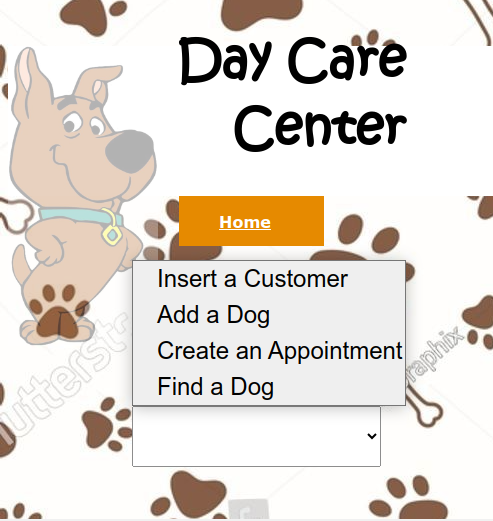
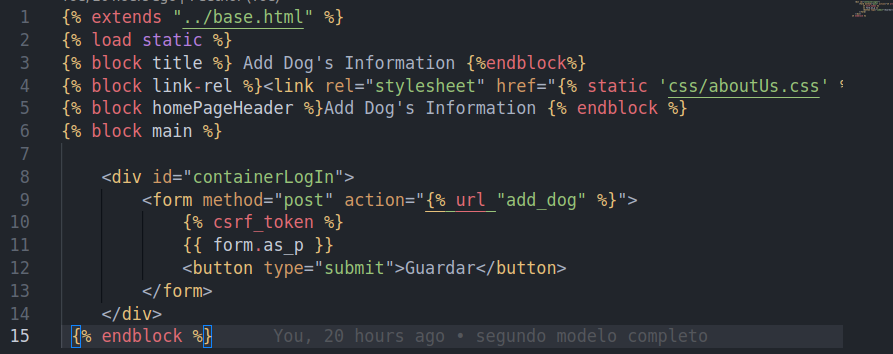

# Tercera-pre-entrega-sanchez-cervantes

La Web es un centro que da cuidados y servicios a perros; esta posee:
- Clientes(Customer)
- Los clientes tienen perros ( **'Add Dog'**)
- Se puede crear una cita con **'Create an Appointment'**
- Y buscar si existe el perro en el sistema **'Find a Dog'**, entregando una lista de coincidencias con el nombre del dueño.

## Esta Web implementa

### - Herencia html

Varios Bloques para agregar Títulos y scripts por archivo.

### - Tres Modelos en models.py
	- customer_information
	- dog_information
	- appointment_information
	
### - Los 3 Formularios de inserción 
		- Insert a Customer
		- Add Dog
		- Create an appointment

### - Formulario de Busqueda
		- Find a Dog
		
### - Extras
	No resisti cambiar el formulario de Administración (Appointment_informations). Si desea mirarlo con la cuenta:
	usr:arturo
	pws:django.123